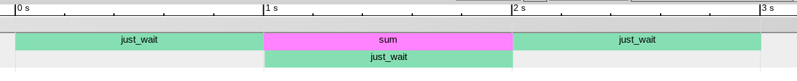

# CProfiler
### Ported from TheCherno's gist:
https://gist.github.com/TheCherno/31f135eea6ee729ab5f26a6908eb3a5e

## Usage
1. Copy the `instrumentor.h` and `instrumentor.c` files to your project.
2. Write `PROFILE_FUNCTION();` at the beginning of every function you want to profile.
3. In the `main()` function write `begin_profiling_session("results.json");` to start a profiling session.
4. End the profiling with `end_profiling_session();` (usually at the end of the program).
5. Run your program.
6. Open a Chromium based browser (Google Chrome, Opera etc.) and navigate to `chrome://tracing`.
7. Click the load button and open the generated json file. You can also do drag and drop.

## Example
```C
#include <unistd.h>
#include "instrumentor.h"

static void just_wait() {
	PROFILE_FUNCTION();

	sleep(1);
}

static int sum(size_t n) {
	PROFILE_FUNCTION();

	int s = 0;
	for (int i = 0; i < n; i++) {
		s += i;
	}

	just_wait();
	return s;
}

int main() {
	begin_profiling_session("results.json");

	just_wait();
	printf("%i\n", sum(1000000));
	just_wait();

	end_profiling_session();

	return 0;
}
```

### Result
